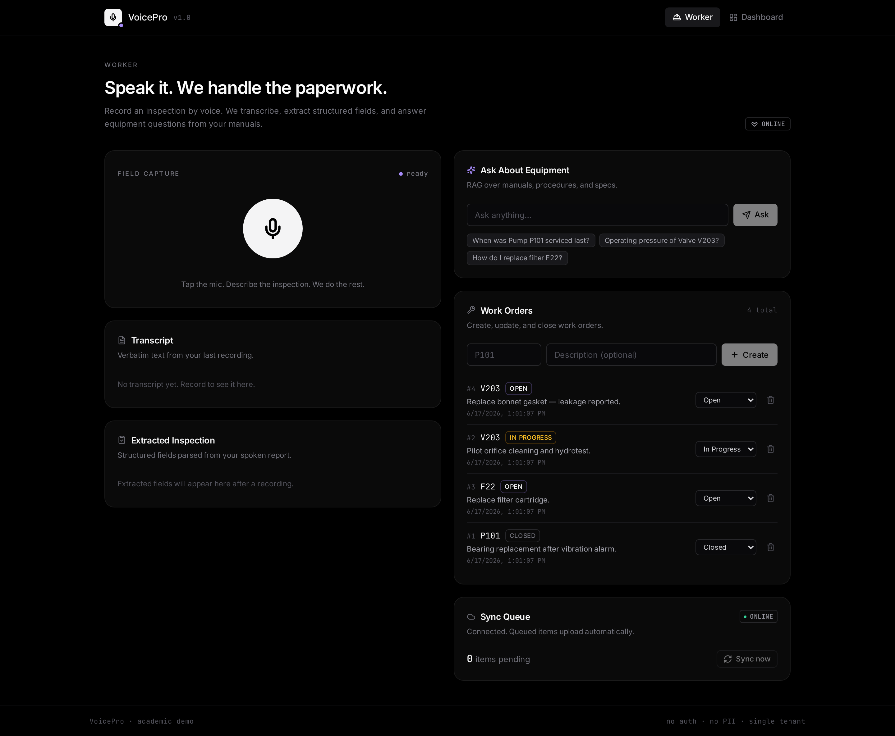
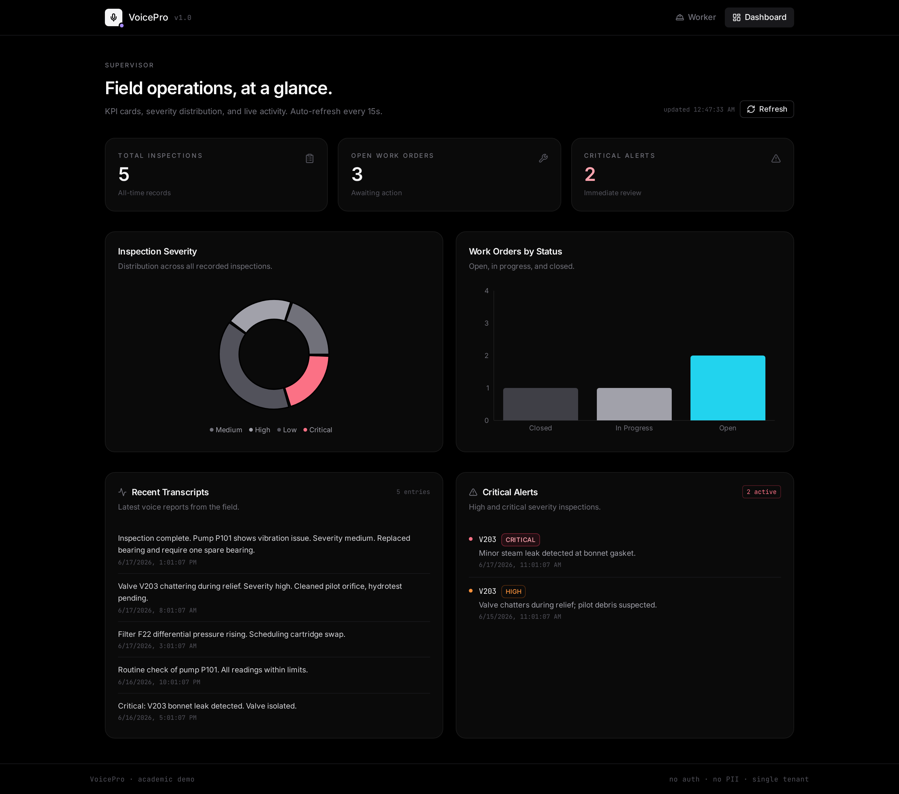

# VoxOps · Voice-First AI Assistant for Field Workers

> Hands-free inspections, equipment queries, and work-order management — powered by Groq Whisper + Llama 3.3.

[](LICENSE)
[](#stack)
[](https://console.groq.com)

A field technician speaks; VoxOps transcribes, extracts a structured
inspection record, answers questions from the equipment manuals, and keeps
working when the signal drops.



---

## Pages

| Route | What it does |
|---|---|
| `/` | **Landing.** Hero, features, how-it-works, architecture, footer. |
| `/worker` | **Worker console.** Mic, transcript, extracted inspection, Q&A, work orders, sync queue. |
| `/dashboard` | **Supervisor view.** KPI cards, severity donut, status bars, recent transcripts, critical alerts. |
| `/getting-started` | Step-by-step tour. Read this first. |
| `/help` | Example phrases, UI section reference, FAQ. |
| `/sample-data` | P101, V203, F22 — specs, history, work orders, sample questions. |

A first-time onboarding modal fires on any non-landing route and tells the
user exactly which two phrases to try. State persists in `localStorage`.

---

## Features

- **Voice capture** — record audio in the browser, transcribe via Groq `whisper-large-v3`.
- **Structured extraction** — Groq `llama-3.3-70b-versatile` in JSON mode pulls 5 fields: `equipment_id`, `fault_description`, `severity`, `action_taken`, `parts_required`.
- **RAG question answering** — ChromaDB + sentence-transformers (`all-MiniLM-L6-v2`) over plain-text manuals, grounded answer with source citations.
- **Voice responses** — browser's Web Speech API speaks the answer (no key, no cost, works everywhere).
- **Work-order management** — full CRUD by equipment tag.
- **Offline queue** — recordings buffer to `localStorage`, auto-sync on reconnect.
- **Supervisor dashboard** — KPIs, charts, alerts, auto-refresh every 15s.

---

## Stack

- **Frontend:** React 18 · Vite · TypeScript · TailwindCSS · React Query · Recharts · React Router
- **Backend:** FastAPI · SQLAlchemy 2 · SQLite · Pydantic v2
- **AI:** Groq (OpenAI-compatible) — `whisper-large-v3` + `llama-3.3-70b-versatile`
- **RAG:** sentence-transformers (`all-MiniLM-L6-v2`) + ChromaDB persistent client
- **TTS:** browser `SpeechSynthesis` (zero backend dep)

---

## Quick start (local)

### 1. Backend

```bash
cd backend
python3.11 -m venv .venv
source .venv/bin/activate          # Windows: .venv\Scripts\activate
pip install -r requirements.txt
cp .env.example .env                # then add your Groq key
python -m app.seed                  # seed sample data + index knowledge base
uvicorn app.main:app --reload --port 8000
```

`/docs` serves the OpenAPI spec at <http://localhost:8000/docs>.

Grab a **free** Groq key at <https://console.groq.com/keys>. `.env.example`
already points `OPENAI_BASE_URL` at the Groq endpoint — just paste the key
into `OPENAI_API_KEY=gsk_…`.

### 2. Frontend

```bash
cd frontend
npm install
npm run dev
```

Open <http://localhost:5173>.

---

## Architecture

```
        ┌─────────────────────────────┐
        │  Browser (React + Vite)     │
        │  ─ Landing / Worker / Dash  │
        │  ─ MediaRecorder + SpeechSynth │
        └─────────────┬───────────────┘
                      │  fetch /api/*  (Vite proxy → :8000)
                      ▼
        ┌─────────────────────────────┐
        │  FastAPI (Python)           │
        │  ─ /transcribe  /extract    │
        │  ─ /query  /inspections     │
        │  ─ /work-orders  /sync      │
        │  ─ /dashboard/stats         │
        └──────┬──────────────┬───────┘
               │              │
        ┌──────▼──────┐ ┌─────▼──────────┐
        │  SQLite     │ │  ChromaDB +    │
        │  (records)  │ │  MiniLM embeds │
        └─────────────┘ └─────┬──────────┘
                              │
                       knowledge_base/  (3 .txt files)

         External: Groq OpenAI-compatible API
          ─ whisper-large-v3        (audio → text)
          ─ llama-3.3-70b-versatile (extract + RAG answer)
```

---

## API

| Method | Path | Purpose |
|--------|------|---------|
| GET | `/health` | Liveness probe used by the offline poller. |
| POST | `/transcribe` | Multipart audio upload → text. |
| POST | `/extract` | Transcript → structured inspection JSON. |
| POST | `/inspections` | Persist an extracted inspection. |
| GET | `/inspections` | List recent inspections. |
| POST | `/query` | RAG question answering over the manuals. |
| GET | `/work-orders` | List work orders. |
| POST | `/work-orders` | Create a work order. |
| PUT | `/work-orders/{id}` | Update status / description. |
| DELETE | `/work-orders/{id}` | Delete a work order. |
| POST | `/sync` | Drain the offline transcript queue. |
| GET | `/dashboard/stats` | KPIs + chart data for the supervisor view. |

Full OpenAPI spec: <http://localhost:8000/docs>.

---

## Demo flow

1. Open <http://localhost:5173/>. The landing page loads.
2. Click **Launch Demo** → `/worker`. The onboarding modal appears.
3. Tap the mic and say:
   *"Inspection complete for Pump P101. Severe vibration detected. Severity high. Replaced bearing. Need two spare bearings."*
4. Release the mic. The transcript appears, then 5 structured fields fill in.
5. Press **Save inspection**.
6. In the Ask panel, type or tap:
   *"When was Pump P101 serviced last?"* — a grounded answer renders and the
   browser speaks it aloud.
7. Create a work order for `P101`. Flip its status. Delete it.
8. Open **Dashboard**. Watch the KPI cards, donut, bar chart, recent
   transcripts, and critical-alerts panel all reflect the new data.

---

## Screenshots

| Worker console | Supervisor dashboard |
|---|---|
|  |  |

---

## Deployment

### Frontend → Vercel

`vercel.json` at the repo root is ready. It:

- builds with `npm --prefix frontend ci && npm --prefix frontend run build`
- serves from `frontend/dist`
- rewrites `/api/*` to the Render backend URL
- adds far-future caching for hashed assets

**Steps:**
1. `vercel link` from the repo root.
2. Edit the rewrite `destination` in `vercel.json` to your Render URL.
3. `vercel --prod`.

No environment variables needed on Vercel — all API traffic is proxied.

### Backend → Render

`render.yaml` at the repo root defines a Python web service:

- runtime: Python 3.11.9
- build: `pip install -r requirements.txt`
- start: `uvicorn app.main:app --host 0.0.0.0 --port $PORT`
- health check: `/health`

**Steps:**
1. Push to GitHub.
2. In Render: **New → Blueprint → connect repo**.
3. Add the secret `OPENAI_API_KEY` (your Groq key) in the Render dashboard.
   The other env vars are populated automatically from `render.yaml`.
4. Deploy. Hit `<service-url>/health` to confirm.
5. Copy the service URL into `vercel.json` `rewrites[0].destination`.

CORS is already permissive (`allow_origins=["*"]`) — works with any frontend
origin out of the box.

---

## Environment variables

| Variable | Example | Notes |
|---|---|---|
| `OPENAI_API_KEY` | `gsk_…` | Groq key (or any OpenAI-compatible). Required for AI features. |
| `OPENAI_BASE_URL` | `https://api.groq.com/openai/v1` | OpenAI-compatible endpoint. |
| `WHISPER_MODEL` | `whisper-large-v3` | Groq Whisper model. |
| `CHAT_MODEL` | `llama-3.3-70b-versatile` | Groq chat model. |
| `EMBEDDING_MODEL` | `all-MiniLM-L6-v2` | Local sentence-transformers model. |
| `DATABASE_URL` | `sqlite:///./voicepro.db` | SQLAlchemy URL. |

Without `OPENAI_API_KEY`:
- transcription returns a 503 with a clear message
- extraction falls back to a regex heuristic
- RAG returns the top-1 retrieved chunk verbatim
- voice playback still works (browser TTS)
- everything else is fully functional

---

## Repository layout

```
voxops/
├── backend/
│   ├── app/
│   │   ├── main.py
│   │   ├── models.py, schemas.py, database.py
│   │   ├── seed.py
│   │   ├── routes/        # transcription, inspection, query, work_orders, dashboard
│   │   ├── services/      # whisper, extraction, rag, sync
│   │   ├── vector_store/  # ChromaDB persistence (gitignored)
│   │   └── knowledge_base/  # sample equipment docs
│   ├── requirements.txt
│   └── .env.example
├── frontend/
│   ├── src/
│   │   ├── pages/         # Landing, Worker, Dashboard, GettingStarted, Help, SampleData
│   │   ├── components/    # ui/, OnboardingModal, ErrorBoundary, feature cards
│   │   ├── api/           # client, endpoints, types
│   │   ├── hooks/         # useRecorder, useOfflineQueue
│   │   └── lib/utils.ts
│   ├── public/            # docs-worker.png, docs-dashboard.png
│   ├── package.json, vite.config.ts, tailwind.config.js
│   └── .env.example
├── docs/screenshots/
├── vercel.json
├── render.yaml
├── LICENSE
└── README.md
```

---

## Known limitations

- No authentication, role management, or audit log — single-user demo.
- Offline transcription is not possible (no in-browser Whisper). Offline
  recordings get a placeholder and re-transcribe nothing — the captured
  audio is lost on tab close. This is intentional for the demo scope.
- Knowledge base is plain text. PDF ingestion is out of scope.
- ChromaDB indexes run in-process; no external vector service.
- Web Speech voice quality varies by OS — the answer text is always shown.

---

## License

[MIT](LICENSE). Educational project — feel free to fork.
